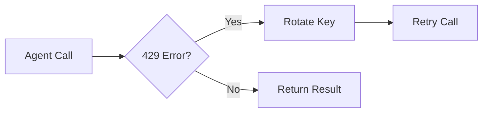

# CIRO Technical Architecture

This document provides a deep dive into the engineering principles and agentic logic that power the **Crisis Intelligence & Response Orchestrator (CIRO)**.

---

## 🏗️ System Design Goals

1.  **Transparency**: Every decision made by the AI must be traceable and explainable.
2.  **Resilience**: The system must handle API failures and rate limits without crashing.
3.  **Accuracy**: Crisis classification must be high-confidence before triggering simulations.
4.  **Localization**: The system must understand the linguistic and geographical context of Islamabad.

---

## 🤖 The Multi-Agent System (MAS)

CIRO utilizes a **Sequential Chain of Agents** orchestrated by a central controller. This design ensures that each agent focuses on a narrow, well-defined task, improving the overall reliability of the pipeline.

### 1. SignalCollector
- **Role**: Data Ingestion & Sanitization.
- **Logic**: Uses Gemini to strip emojis, normalize casing, and detect the input language. It specifically handles **Roman Urdu** (e.g., "Pani bohot hai") and converts it into a structured format for downstream agents.
- **File**: [signal_collector.py](file:///backend/agents/signal_collector.py)

### 2. CrisisDetector
- **Role**: Intent Classification.
- **Logic**: Classifies the report into one of five categories: `flood`, `accident`, `heatwave`, `blockage`, or `infrastructure`.
- **Confidence Scoring**: If confidence is below 60%, the report is marked for manual review instead of automatic simulation.
- **File**: [crisis_detector.py](file:///backend/agents/crisis_detector.py)

### 3. ReasoningAnalyzer
- **Role**: Severity & Priority Calculation.
- **Logic**: Evaluates the potential impact based on the report text and area. It calculates a `priority_score` (0-100) using a weighted formula that considers severity level and confirmation from other sources.
- **File**: [reasoning_analyzer.py](file:///backend/agents/reasoning_analyzer.py)

### 4. ActionPlanner
- **Role**: Strategy Generation.
- **Logic**: Maps the crisis type to specific departments (Rescue 1122, Islamabad Police, etc.) and generates a prioritized list of response actions.
- **File**: [action_planner.py](file:///backend/agents/action_planner.py)

### 5. Simulator
- **Role**: Impact Prediction.
- **Logic**: Simulates the execution of the action plan. It generates mock before/after route ETAs and produces a digital "Emergency Ticket" for field personnel.
- **File**: [simulator.py](file:///backend/agents/simulator.py)

---

## 🎼 Orchestration Logic

The **CIRO Orchestrator** implements a **Hybrid Orchestration Mechanism**:

### Mechanism 4 Appearance (Narrated Handover)
While the sequence of agents is deterministic (Sequential), the Orchestrator performs an LLM-based "Narration" between each step.

```python
def narrate_decision(state, next_agent):
    # LLM explains WHY it is moving to the next agent
    # This narration is saved to the agent_trace
```

This approach combines the **reliability** of a state machine with the **flexibility** and **explainability** of an agentic system.

### API Key Rotation (Fail-Safe)
To avoid `429 Too Many Requests` errors during the hackathon, the `ClientManager` manages a pool of API keys.



---

## 📊 Data Flow & State Management

The system uses a **Shared State Object** that is passed between agents. Each agent appends its findings to the state, which is eventually persisted to **Supabase**.

### Shared State Schema
```json
{
  "report_id": "uuid",
  "raw_input": { ... },
  "cleaned_text": "...",
  "detected_language": "...",
  "crisis_type": "...",
  "crisis_confidence": 0,
  "severity": "...",
  "action_plan": [ ... ],
  "simulation_result": { ... },
  "trace": [
    {
      "agent": "SignalCollector",
      "decision": "Cleaned the text and detected Roman Urdu.",
      "timestamp": "..."
    },
    ...
  ]
}
```

---

## 🎨 Visual Identity & UX

The **Mobile Client** follows a "NASA Mission Control" aesthetic:
- **High Contrast**: Dark backgrounds with vibrant status indicators (Red for Critical, Yellow for High).
- **Skeleton Loading**: Ensures a smooth perceived performance during background refreshes.
- **Real-time Subscriptions**: Uses Supabase Postgres Changes to update the UI the moment an agent finishes its task.

---

For implementation details, refer to the [backend source code](file:///backend/).
