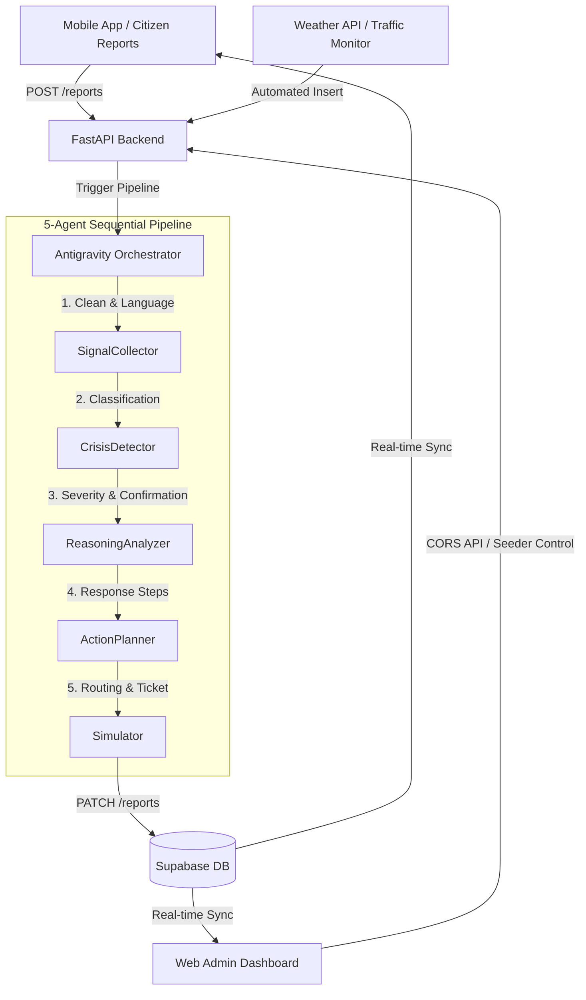

# CIRO — Crisis Intelligence & Response Orchestrator

[](https://antigravity.google.com)
[](https://antigravity.google.com)

> **CIRO** is an advanced, real-time agentic AI system designed to detect, analyze, and coordinate emergency responses to urban crises. Built for the **Innovista Hackathon**, CIRO leverages **Google Antigravity** to orchestrate a highly coordinated multi-agent pipeline for metropolitan resilience in Islamabad, Pakistan.

---

## 🚀 Overview

CIRO (Crisis Intelligence & Response Orchestrator) transforms multi-source emergency signals into structured, actionable response strategies. By ingestion of citizen reports, weather events, and traffic telemetry, CIRO feeds a unified command center for municipal emergency departments (Rescue 1122, Islamabad Traffic Police, CDA Emergency, etc.).

### Core Features
- **Multi-Agent Orchestration**: A 5-agent sequential pipeline powered by **Gemini 2.5 Flash** and managed by a central Orchestrator.
- **Narrated Agentic Trace**: Explains every decision and transition during handovers with natural language explainability.
- **Web-Based Admin Dashboard**: A premium operator control panel displaying real-time incidents, live trace playbacks, seeder controls, and data analytics.
- **Mobile Client App**: A high-performance, field-ready Flutter app featuring manual/telemetry report submissions, active incident routing, and a NASA-inspired dark theme.
- **API Key Fail-Safe**: Automated rotative failover across 5 Gemini API keys with backoff strategies to sustain high-frequency evaluation.
- **Linguistic Resilience**: Tailored for Pakistan with multi-language parsing (English, Urdu script, and Roman Urdu e.g. *"faizabad interchange pe road block hai"*).
- **Proactive Environmental Monitors**: Live OpenWeatherMap precipitation tracking, simulated peak-hour traffic congestion alerts, and automated incident resolution based on travel times.

---

## 🏗️ System Architecture

CIRO is built on a modern, distributed architecture designed for maximum reliability and scalability.



### Technical Stack
- **Backend Services**: Python 3.11, [FastAPI](file:///backend/main.py), Uvicorn.
- **Orchestration**: Google ADK (Antigravity Development Kit).
- **AI Models**: Google Gemini 2.5 Flash (agents) & Gemini Flash Latest (orchestrator narration).
- **Database**: Supabase (PostgreSQL) with Real-time PostgreSQL Changes subscriptions.
- **Web Command Panel**: React 19, Vite, Tailwind CSS 4, React Query, Recharts.
- **Mobile Client**: Flutter 3 (Dart) with Riverpod State Management and `flutter_animate`.

---

## 🧠 The 5-Agent Pipeline

Every crisis report initiates a sequential reasoning process orchestrated by the [CIRO Orchestrator](file:///backend/agents/orchestrator.py).

| Agent | Responsibility | Key Output | Code Reference |
| :--- | :--- | :--- | :--- |
| **SignalCollector** | Text cleaning, Roman Urdu parsing, & location normalization | `cleaned_text`, `detected_language`, `normalized_location` | [signal_collector.py](file:///backend/agents/signal_collector.py) |
| **CrisisDetector** | Intent classification (`flood`, `accident`, `heatwave`, `blockage`, `infrastructure`) & confidence assessment | `crisis_type`, `crisis_confidence` (flags < 60% for manual review) | [crisis_detector.py](file:///backend/agents/crisis_detector.py) |
| **ReasoningAnalyzer** | Severity level determination (`low` to `critical`), confirmation verification, & explanation compilation | `severity`, `severity_explanation`, `confirming_sources` | [reasoning_analyzer.py](file:///backend/agents/reasoning_analyzer.py) |
| **ActionPlanner** | Multi-departmental response strategy and resource allocation planning | `action_plan` (Police, Rescue 1122, Fire Dept, CDA, etc.) | [action_planner.py](file:///backend/agents/action_planner.py) |
| **Simulator** | Destination selection, route routing simulation, ticket numbering, and public alerts | `simulation_result` (before/after route ETAs, ticket, dispatch logs) | [simulator.py](file:///backend/agents/simulator.py) |

> [!TIP]
> **Hybrid Orchestration (Narrated Handover)**: While agent transitions are sequential, the Orchestrator invokes Gemini between each step to generate a natural language narration explaining *why* it is progressing to the next stage. This narration is logged to the `agent_trace` field for complete auditability.

---

## 🛠️ Key Design Decisions

### 1. Robust API Management & Key Rotation
To guarantee resilience and bypass Gemini rate limits, [client_manager.py](file:///backend/agents/client_manager.py) manages a pool of 5 API keys. When a `429 Too Many Requests` error is encountered, the manager automatically rotates to the next key and retries the request with an intelligent backoff.

### 2. Multi-Source Intelligence Monitors
CIRO ingests three primary types of incident telemetry in the [FastAPI Backend](file:///backend/main.py):
- **Manual Reports**: Field reports submitted via the Flutter Mobile client or the React dashboard.
- **Social Media Seeder**: High-velocity social posts injected via [seeder.py](file:///backend/seeder.py), which can be started, stopped, or manually seeded on-demand directly from the React dashboard interface.
- **Weather API Monitor**: Active background task polling the OpenWeatherMap API. In the event of heavy rain (>0.1mm/h) or extreme temperature (>25°C), it automatically drafts and injects corresponding crisis reports.
- **Traffic API Monitor**: Simulates congestion levels based on rush hours for major corridors in Islamabad (Highway, Blue Area, Faizabad, G-10 Markaz, F-7 Markaz) to trigger blockage reports.

### 3. Linguistic Resilience
The **SignalCollector** is engineered to recognize Urdu script and Roman Urdu (Hinglish/Urdu text typed in English characters). It translates and normalizes the text so that downstream analysis remains precise regardless of language style.

### 4. Interactive Live Seeder Subprocess
Rather than blocking the main web server thread, the seeder is executed as a separate unbuffered OS subprocess (`sys.executable seeder.py`). The FastAPI backend opens a non-blocking output stream reader that redirects standard stdout directly to the React dashboard operator logs console in real-time.

### 5. Automated Incident Auto-Resolution
The backend runs an asynchronous background loop checking simulated reports. Once the simulated travel ETA (in minutes) from the crisis location to the target emergency department has elapsed, the backend automatically transitions the database status to `resolved`.

---

## 📂 Project Structure

```text
CIRO/
├── backend/
│   ├── agents/            # Multi-agent logic (ADK & Gemini API clients)
│   │   ├── client_manager.py     # API Key rotation management
│   │   ├── orchestrator.py       # Sequential orchestration & handover narrations
│   │   ├── signal_collector.py   # Text normalizer & language detector
│   │   ├── crisis_detector.py    # Intent classifier & score checker
│   │   ├── reasoning_analyzer.py # Severity levels & confirming sources evaluator
│   │   ├── action_planner.py     # Departments dispatcher & tasks creator
│   │   └── simulator.py          # Alternate routing simulation & ticket generator
│   ├── data/              # Mock and seed databases
│   ├── main.py            # FastAPI Web Server, monitors, CORS, & seeder routes
│   ├── models.py          # Pydantic schemas and database models
│   ├── database.py        # Supabase client instantiation
│   └── seeder.py          # Standalone social media generator script
├── ciro_dashboard/        # React operator panel
│   ├── src/
│   │   ├── components/    # Shell, Recharts layout, and shared items
│   │   ├── hooks/         # Custom queries and React Query mutations (useSeeder, etc.)
│   │   ├── pages/         # Dashboard, Reports, Analytics, Seeder logs, and Trace viewer
│   │   └── lib/           # Axios API configuration & endpoint maps
│   └── package.json       # Frontend dependencies (Tailwind 4, React 19, Recharts)
├── ciro_mobile_client/    # Flutter application
│   ├── lib/
│   │   ├── screens/       # Dashboard list, submission form, and trace timeline
│   │   ├── providers/     # State management controllers (Riverpod)
│   │   ├── services/      # Supabase and API network client
│   │   └── theme/         # NASA-inspired custom dark styles
│   └── pubspec.yaml       # Dart dependencies
├── PROJECT_SPEC.md        # Technical requirements and database schema spec
├── ARCHITECTURE.md        # Deep dive into agent details and trace payload formats
└── INTEGRATION_CHANGES.md # Documentation of backend-dashboard connection modifications
```

---

## 🚦 Getting Started

### 1. Prerequisites
- **Python**: version `3.11.x`
- **Node.js**: version `>= 18.x`
- **Flutter**: SDK `>= 3.0.0`
- **Supabase**: Access to a Supabase project containing the `reports` table. (Refer to [PROJECT_SPEC.md](file:///PROJECT_SPEC.md#table-schema) for the PostgreSQL schema).

### 2. Backend Setup
1. Navigate to the backend directory:
   ```bash
   cd backend
   ```
2. Install Python packages:
   ```bash
   pip install -r requirements.txt
   ```
3. Create a `.env` file inside the `backend/` directory with the following variables:
   ```env
   SUPABASE_URL=YOUR_SUPABASE_PROJECT_URL
   SUPABASE_SERVICE_KEY=YOUR_SUPABASE_SERVICE_ROLE_KEY
   GEMINI_API_KEY_1=YOUR_GEMINI_KEY_1
   GEMINI_API_KEY_2=YOUR_GEMINI_KEY_2 (Optional fallback)
   GEMINI_API_KEY_3=YOUR_GEMINI_KEY_3 (Optional fallback)
   GEMINI_API_KEY_4=YOUR_GEMINI_KEY_4 (Optional fallback)
   GEMINI_API_KEY_5=YOUR_GEMINI_KEY_5 (Optional fallback)
   OWM_API_KEY=YOUR_OPENWEATHERMAP_API_KEY
   ```
4. Start the FastAPI development server:
   ```bash
   uvicorn main:app --reload
   ```

### 3. Dashboard Setup
1. Navigate to the dashboard directory:
   ```bash
   cd ciro_dashboard
   ```
2. Install Node packages:
   ```bash
   npm install
   ```
3. Verify that the `ciro_dashboard/.env` file points to the running backend:
   ```env
   VITE_API_BASE_URL=http://127.0.0.1:8000
   ```
4. Start the Vite React development server:
   ```bash
   npm run dev
   ```

### 4. Mobile Setup
1. Navigate to the mobile client directory:
   ```bash
   cd ciro_mobile_client
   ```
2. Install Flutter packages:
   ```bash
   flutter pub get
   ```
3. Configure the environment by setting the API routes in `lib/config/app_config.dart` or `.env`.
4. Run the mobile application:
   ```bash
   flutter run
   ```

---

## 🏆 Hackathon Evaluation

| Criteria | Implementation Highlights |
| :--- | :--- |
| **Google Antigravity** | 5 specialized agents built and sequenced within the Google ADK environment. |
| **Agentic Reasoning** | Fully auditable trace timeline logging each step's decision and confidence directly into PostgreSQL. |
| **Innovation** | Auto-resolution based on simulated travel times, language detection (Roman Urdu), and parallel logging subprocesses. |
| **Visual Excellence** | High-fidelity dashboards: React admin panel (rich Recharts charts, trace player, live logging) and Flutter mobile (NASA Mission Control dark mode). |

---

Developed with ❤️ for the **Innovista Hackathon 2026**.
