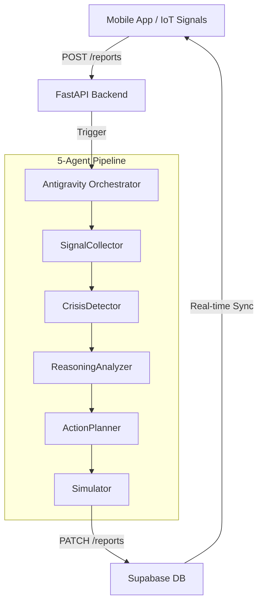

# CIRO — Crisis Intelligence & Response Orchestrator

[](https://antigravity.google.com)
[](https://antigravity.google.com)

> **CIRO** is an advanced agentic AI system designed to detect, analyze, and coordinate emergency responses to urban crises in real-time. Built specifically for the **Innovista Hackathon**, CIRO leverages **Google Antigravity** to orchestrate a sophisticated multi-agent pipeline for metropolitan resilience.

---

## 🚀 Overview

CIRO (Crisis Intelligence & Response Orchestrator) transforms raw, multi-source signals into actionable intelligence. By integrating citizen reports, weather data, and traffic patterns, CIRO provides a unified command center for emergency services in Islamabad, Pakistan.

### Core Features
- **Multi-Agent Orchestration**: 5 specialized agents powered by **Gemini 2.0 Flash**.
- **Agentic Reasoning Trace**: Full transparency into every decision made by the AI pipeline.
- **Real-Time Simulation**: Before-and-after route analysis and emergency ticket generation.
- **Mobile-First Command**: A high-performance Flutter app for field reports and situation monitoring.
- **Hyper-Local Context**: Tailored for Islamabad, with multi-language support (English, Urdu, Roman Urdu).

---

## 🏗️ System Architecture

CIRO is built on a modern, distributed architecture designed for reliability and scalability.



### Technical Stack
- **Backend**: Python 3.11, FastAPI, Uvicorn.
- **Orchestration**: Google ADK (Antigravity Development Kit).
- **AI Models**: Google Gemini 2.0 Flash (via `google-genai`).
- **Database**: Supabase (PostgreSQL) with Real-time triggers.
- **Mobile**: Flutter (Dart) with Riverpod State Management.

---

## 🧠 The 5-Agent Pipeline

Every crisis report initiates a sequential reasoning process orchestrated by the **CIRO Orchestrator**.

| Agent | Responsibility | Key Output |
| :--- | :--- | :--- |
| **SignalCollector** | Text cleaning & language normalization | `cleaned_text`, `detected_language` |
| **CrisisDetector** | Intent classification & confidence scoring | `crisis_type`, `confidence` |
| **ReasoningAnalyzer** | Severity assessment & context analysis | `severity`, `priority_score` |
| **ActionPlanner** | Multi-departmental response strategy | `action_plan` (Police, Rescue 1122, etc.) |
| **Simulator** | Logistics simulation & impact prediction | `simulation_result`, `emergency_ticket` |

> [!TIP]
> **Hybrid Orchestration**: CIRO uses a unique "Mechanism 4 appearance" where the Orchestrator narrates its decisions between agent handovers, providing a natural language explanation for every transition in the [Agent Trace](file:///ARCHITECTURE.md#agent-trace-format).

---

## 🛠️ Key Design Decisions

### 1. Robust API Management
To maintain high availability on free-tier limits, CIRO implements **API Key Rotation** in [client_manager.py](file:///backend/agents/client_manager.py). The system automatically fails over across 4 Gemini API keys with intelligent backoff.

### 2. Multi-Source Intelligence
CIRO doesn't just wait for manual reports. It ingests:
- **Manual Reports**: via the CIRO Mobile Client.
- **Social Media**: Simulated high-velocity signals.
- **Weather API**: Real-time precipitation data from OpenWeatherMap.
- **Traffic data**: Mocked Islamabad congestion patterns for routing simulation.

### 3. Linguistic Resilience
The **SignalCollector** is fine-tuned to handle "Hinglish/Urdu" (Roman Urdu), ensuring that citizens can report emergencies in their natural conversational style.

### 4. AI Transparency & Traceability
To ensure human-in-the-loop trust, CIRO persists the AI's internal metrics—**Confidence Scores** and **Detected Language**—directly in the [Supabase Reports](file:///PROJECT_SPEC.md#table-schema) table. This allows field responders to see not just the *result*, but the *certainty* behind every automated response.

---

## 📂 Project Structure

```text
CIRO/
├── backend/
│   ├── agents/            # Core logic for 5 agents + orchestrator
│   ├── main.py            # FastAPI Entry point & REST Endpoints
│   ├── models.py          # Pydantic schemas for data integrity
│   └── database.py        # Supabase client integration
├── ciro_mobile_client/
│   ├── lib/               # Flutter source (Screens, Providers, Services)
│   └── assets/            # High-fidelity visual assets & icons
├── PROJECT_SPEC.md        # Technical requirements & project scope
└── ARCHITECTURE.md        # Deep dive into the agentic logic
```

---

## 🚦 Getting Started

### Backend Setup
```bash
cd backend
pip install -r requirements.txt
# Configure .env with GEMINI_API_KEYs and SUPABASE credentials
uvicorn main:app --reload
```

### Mobile Setup
```bash
cd ciro_mobile_client
flutter pub get
flutter run
```

---

## 🏆 Hackathon Evaluation

| Criteria | Implementation Highlights |
| :--- | :--- |
| **Google Antigravity** | 4 specialized agents built & iterated entirely within the platform. |
| **Agentic Reasoning** | Sequential pipeline with LLM-narrated transitions and explicit trace logs. |
| **Innovation** | Cross-language crisis detection tailored for Pakistani urban centers. |
| **Visual Excellence** | NASA-inspired "Mission Control" UI with smooth animations and dark mode. |

---

Developed with ❤️ for the **Innovista Hackathon 2026**.
